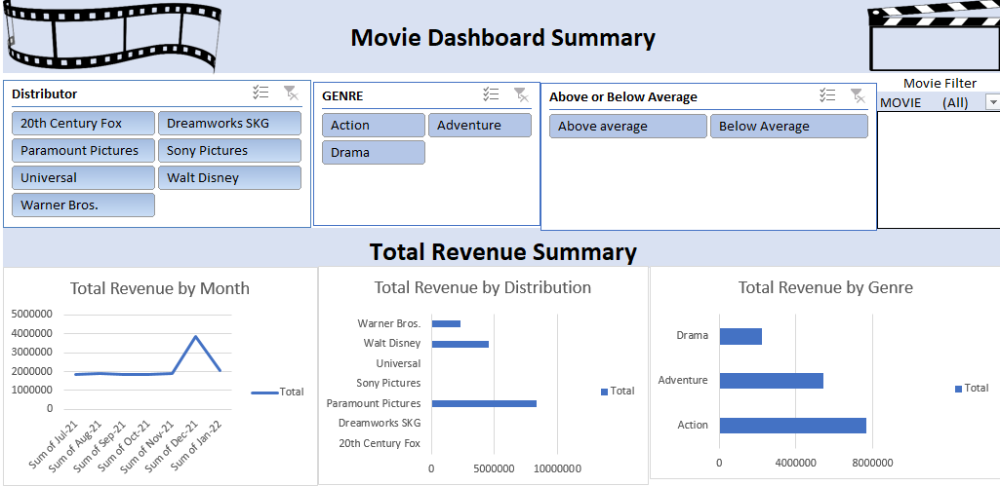

# Ogo_Portfolio
# [Project 1: Movie Dataset Summary](https://ogomatthew.github.io/Ogo_Portfolio/Movie-Dataset-Summary)

# This is a project done during my internship training with internsify Africa, where I build a Movie Dataset Summary.

* Data was obtain from (Kaggle.com)
* The analysis was done using excel to fillter and clean up data before using the pivot table

Overview of Dashboard Summary using the excel Pivot table   ## Popular Movie Genres 

