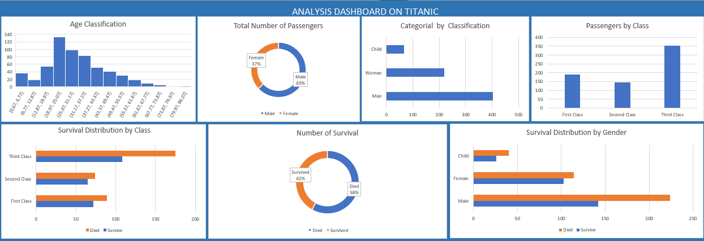

# Ogo_Portfolio
# [Project 1: Titanic Dataset Summary](https://ogomatthew.github.io/Ogo_Portfolio/Movie-Dataset-Summary)

# This project contain insight using dataset from the famous Titanic story, this was a test project done on my internship with Internsify Africa using excel.

* The data used was obtain from (Kaggle.com)
* The analysis was done using excel to fillter and clean up data.
* The Dashboard reviews insights on Age Clarification of Passengers.
* Total Number of Passenger which comprised of 687 with 37% of females and 63% of male.
* Passenger by Class had more of the of third class, followed by first class and second class passengers.
* The survival distribution by class shows that there was more died in the third class passenger, following by first class and then third class
* The number of surivals shows that 42% survived and 58% died at the cause of this incident.
* Survival distribution by genders show that more that 200 male lost their life, more than a 100 female and almost 50 child died at the cause of the accident.

## Overview of Dashboard Summary  

# [Project 2: Dashboard on Walmart Sales Distribution by Trend](https://ogomatthew.github.io/Ogo_Portfolio/Movie-Dataset-Summary)

# This project contain insight using dataset from walmart stores to get the average sales distribution by trend and it was done the Pivot Table in Excel.

* The data used was obtain from (Kaggle.com)
* The analysis was done using pivot table in excel.
* Insight from the dashboard reviewed average sales distribution per store yearly, monthly, weekly, during holidays and workdays.
* 

## Overview of Dashboard Summary  
