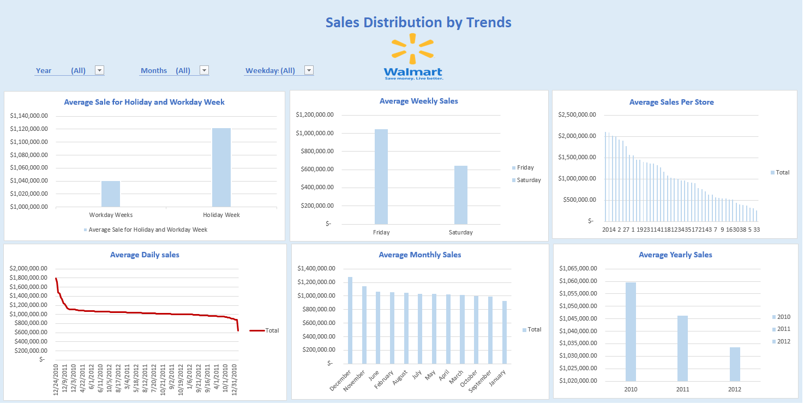

# Ogo_Portfolio
# [Project 1: Global Hospital Ranking]

# Python Project using dataset from Global Hospital Ranking.

* The data used was obtain from (Kaggle.com)
* The analysis was done using python to fillter and clean up data.
* The Dashboard reviews insights on Global Hospital Ranking by Country counts, Top hospital by size, Rich Files, Rank and Scholarrship score.
* From the dataset it was deduced from the top hospital counts that United states  had the highest hospital count and turkey had the lowest.
* It was also seen going by top hospital size that the New york Presbtyterian/lower manhanttan Hospital had the higest hospital size while the cleverland Cliniic had the lest.
* On reviewing the top perfornmance of hospital by Rich files it was seen that the University of Maryland Medical Centerr had the most Rich File while Cleverland Clinic had the lest
* On Ranking the of hospital the New york Presbtyterian/lower manhanttan Hospital has the higest rank among the top hospital by performance 
* Finally on reviewing the top hospital performance by scholarship the New york Presbtyterian/lower manhanttan Hospital also reviews to have the higest scholarship score while Cleverland Clinic was see to have the lowest.
## Overview of Dashboard Summary  

# [Project 1: Titanic Dataset Summary](https://ogomatthew.github.io/Ogo_Portfolio/Movie-Dataset-Summary)

# This project contain insight using dataset from the famous Titanic story, this was a test project done on my internship with Internsify Africa using excel.

* The data used was obtain from (Kaggle.com)
* The analysis was done using excel to fillter and clean up data.
* The Dashboard reviews insights on Age Clarification of Passengers.
* Total Number of Passenger which comprised of 687 with 37% of females and 63% of male.
* Passenger by Class had more of the of third class, followed by first class and second class passengers.
* The survival distribution by class shows that there was more died in the third class passenger, following by first class and then third class
* The number of surivals shows that 42% survived and 58% died at the cause of this incident.
* Survival distribution by genders show that more that 200 male lost their life, more than a 100 female and almost 50 child died at the cause of the accident.

## Overview of Dashboard Summary  

# [Project 2: Dashboard on Walmart Sales Distribution by Trend](https://ogomatthew.github.io/Ogo_Portfolio/Movie-Dataset-Summary)

# This project contain insight using dataset from walmart stores to get the average sales distribution by trend and it was done the Pivot Table in Excel.

* The data used was obtain from (Kaggle.com)
* The analysis was done using pivot table in excel.
* Insight from the dashboard reviewed average sales distribution per store yearly, monthly, weekly, during holidays and workdays.
* The total number of 45 stores were analysed in the dataset with each having an average sales per stores sorted from the largest to lowest shows that store 20, 14 and 2 have the 
  highest sales and 38,5 and 33 the lowest.
* On the weekly sales it shows that there is more sales during the week.
* The monthly sales show that there was more shoping during the December period probably due to the festive period while sale decreased 
  from January as seen on the dashboard, this also correspond with the dates on daily sales chart as there was more sales around 24th, 
  9th, and 3rd of December 2010 and a decline in January.
* Also insight on sale during holidays and workdays shows that there are usually more sale during holidays than workday due to the fact 
  that more person have more time during weekend that workdays for shopping,

## Overview of Dashboard Summary  

