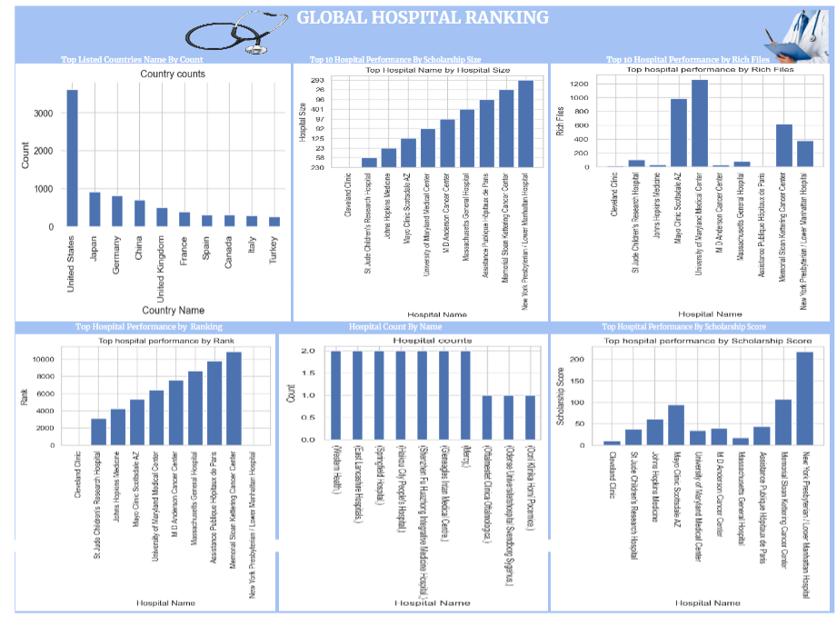

# [Project 1: Global Hospital Ranking]

# Python Project using dataset from Global Hospital Ranking.

* The data used was obtain from (Kaggle.com)
* The analysis was done using python to fillter and clean up data.
* The Dashboard reviews insights on Global Hospital Ranking by Country counts, Top hospital by size, Rich Files, Rank and Scholarrship score.
* From the dataset it was deduced from the top hospital counts that United states had the highest hospital count and turkey had the lowest.
* It was also seen going by top hospital size that the New York Presbtyterian/lower manhanttan Hospital had the highest hospital size while the cleverland Clinic had the lest.
* On reviewing the top perfornmance of hospital by Rich files it was seen that the University of Maryland Medical Centerr had the most Rich File while Cleverland Clinic had the les
* On Ranking the of hospital the New York Presbtyterian/lower manhanttan Hospital has the highest rank among the top hospital by performance
* Finally on reviewing the top hospital performance by scholarship the New york Presbtyterian/lower manhanttan Hospital also reviews to have the highest scholarship score while Cleverland Clinic was see to have the lowest.
## Overview of Dashboard Summary  
